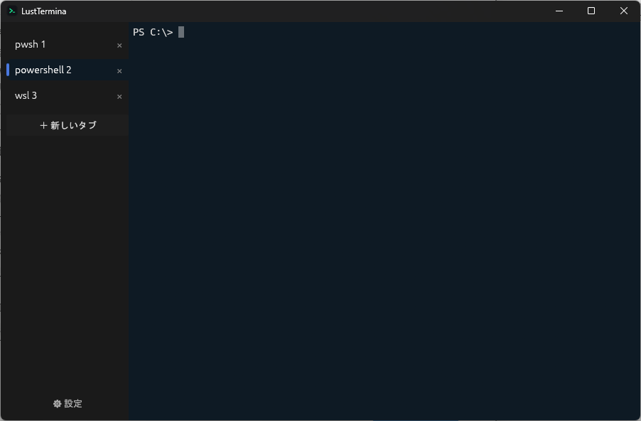
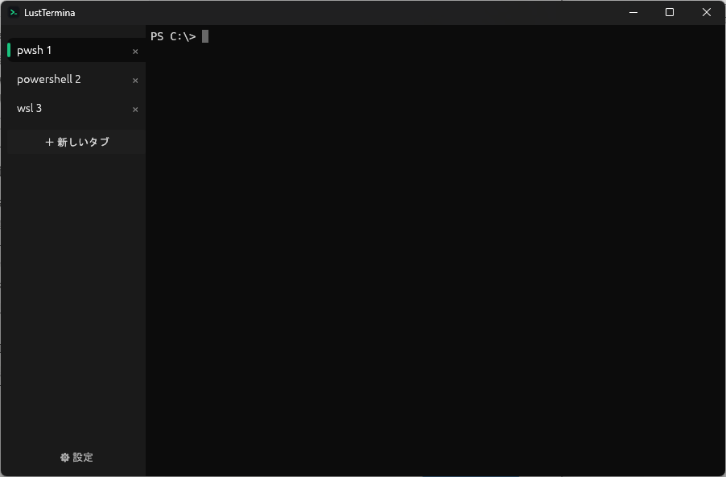
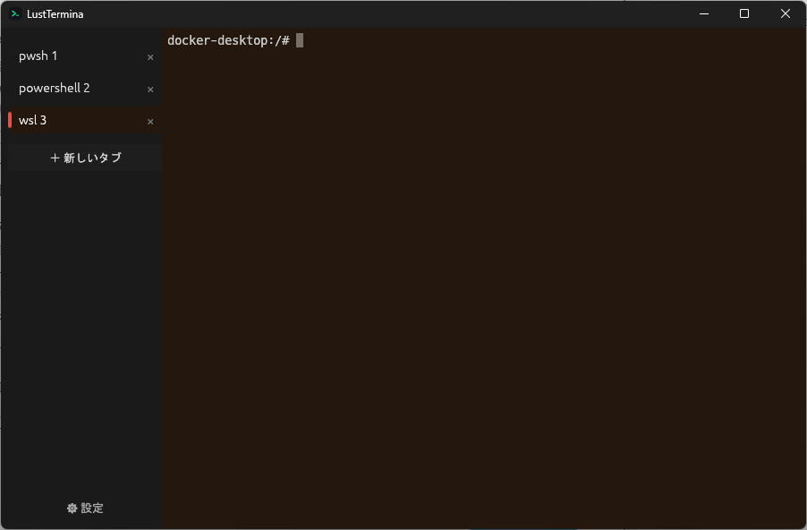
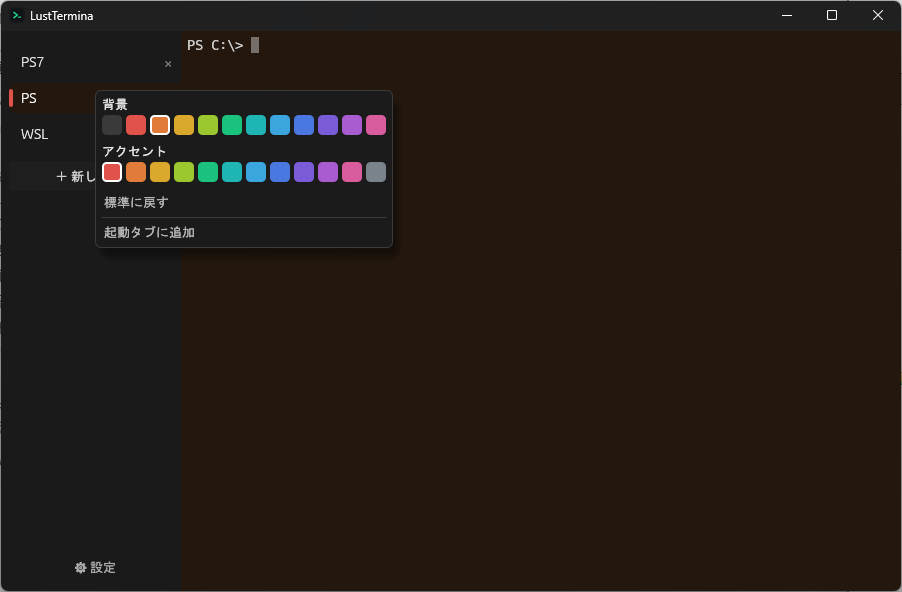
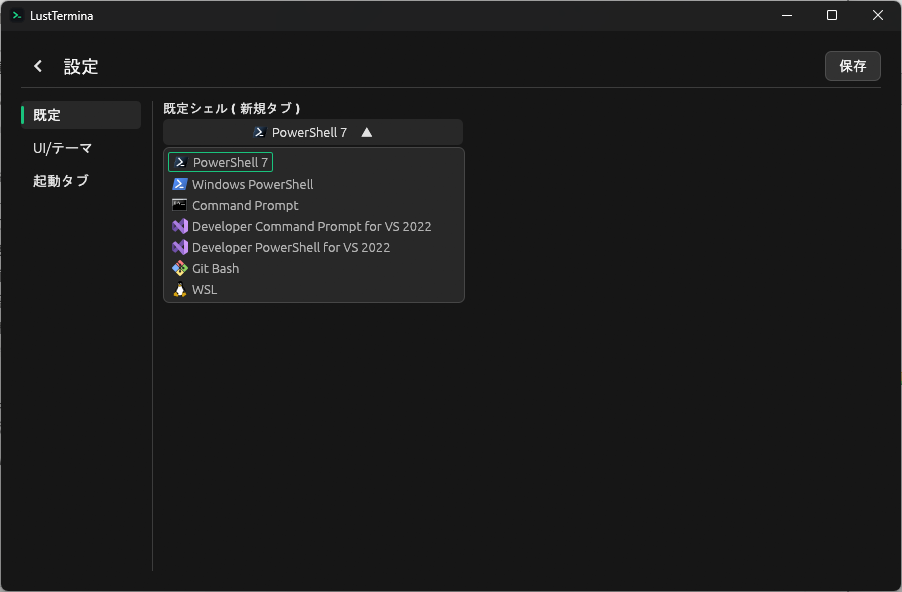
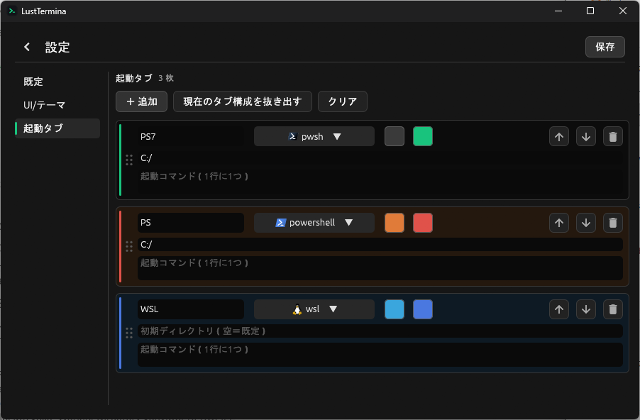
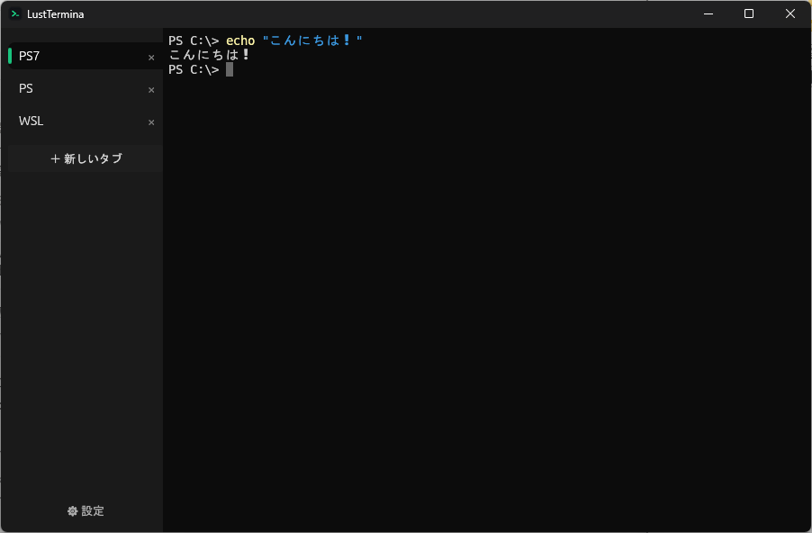

# LustTermina（ラストテルミナ）

**Windows 向けのターミナルエミュレータ。** 複数のシェルを縦タブで並べて使えて、タブごとに色分けでき、よく使う作業環境を「起動タブ」として保存しておける。Rust + egui 製で軽快に動く。



## できること

- **縦タブで並行作業** — PowerShell やコマンドプロンプトなど複数のシェルを 1 ウィンドウにまとめられる。タブはドラッグで並べ替え、ダブルクリックで改名、閉じる時は確認ダイアログで誤操作を防止。
- **タブごとに色分け** — タブ単位で背景色・アクセントカラーを設定。「本番用は赤」「ローカルは青」のように一目で見分けられる。
- **起動タブ** — よく使うタブ構成（シェル・作業フォルダ・起動時に流すコマンド）を保存しておくと、起動時に自動でその環境が開く。毎回のセットアップが要らない。
- **日本語入力・表示に対応** — IME での日本語入力、日本語の表示どちらも OK。
- **マウスで選択 → コピー** — ドラッグで範囲選択して `Ctrl+C` でコピー、`Ctrl+V` で貼り付け。
- **スクロールバック** — マウスホイールで過去の出力（最大 1 万行）を遡れる。入力すると最新位置へ戻る。
- **設定は画面から** — 既定のシェル・作業フォルダ・テーマ・タブパネルの左右配置を GUI で変更。変更内容はファイルに保存され、次回も引き継がれる。
- **見た目** — シェルの種類ごとにアイコンを表示。ウィンドウ／タスクバーにも独自アイコン。

## スクリーンショット

**タブごとに色分け** — 環境ごとに背景色・アクセントカラーを割り当てて見分けられます。

| | |
|:--:|:--:|
|  |  |

**色の設定 ／ 対応シェル** — 色はパレットから選択（「起動タブに追加」で起動構成にも保存）。対応シェルは PowerShell 7・Windows PowerShell・コマンドプロンプト・VS Developer・Git Bash・WSL をアイコン付きで選べます。

| | |
|:--:|:--:|
|  |  |

**起動タブの編集** — よく使うタブ構成（名前・シェル・作業フォルダ・色・起動コマンド）をカードで編集。「現在のタブ構成を抜き出す」で、今開いているタブをそのまま起動構成として保存できます。



**日本語の表示・入力にも対応**



## 動作環境

- Windows 10 / 11
- ビルドする場合は [Rust ツールチェイン](https://www.rust-lang.org/tools/install)

## ダウンロード

[Releases](https://github.com/Capsicum0907/LustTermina/releases) からビルド済みの exe を入手できます（インストール不要・単一ファイル）。

### 初回起動時の警告（SmartScreen）について

ダウンロードした exe は**コード署名していない**ため、初回起動時に Microsoft Defender SmartScreen が

> Windows によって PC が保護されました

と警告を出すことがあります。これは「署名が無く、まだ実行実績の少ない」アプリに対する Windows の既定の挙動で、アプリの中身を危険と判定しているわけではありません。

起動する手順：

1. 警告ダイアログの **「詳細情報」** をクリック
2. 下に現れる **「実行」** ボタンを押す

または、ダウンロードした `.exe` を **右クリック → プロパティ → 全般タブ下部の「ブロックの解除」にチェック → OK** しておくと、以降は警告なしで起動できます。

気になる場合は、下の「使い方」からソースをビルドしてください（自分でビルドした exe にはこの警告は出ません）。

## 使い方

リポジトリを取得してそのまま起動：

```sh
git clone https://github.com/Capsicum0907/LustTermina.git
cd LustTermina
cargo run
```

（初回は依存クレートのコンパイルで数分かかります。以降は数秒。）

**日常使い（ダブルクリックで起動したい場合）：**

```sh
cargo build --release
```

で `target/release/lust_termina.exe` ができるので、これを指すショートカットをデスクトップ等に置くだけ。コンソール窓は出ません。ショートカットの「作業フォルダ」をホームにしておくと、シェルがホームから始まります。

## 設定の保存場所

設定は次のファイルに自動保存されます（手で編集してもOK）：

```
%APPDATA%\LustTermina\config.toml
```

## 既知の制限（これから）

- 選択範囲をスクロールに追従させる処理
- CJK 全角文字の幅計算（描画はされるが幅の扱いは素朴）
- イタリック表示（属性は取得するが斜体フォント面が未ロード）
- マウスレポート / 差分描画（性能最適化）
- IME のインライン変換（現状は候補ウィンドウのみ）

---

## 仕組み（開発者向け）

シェルの入出力を仮想端末(ConPTY)経由でやり取りし、端末エスケープを解釈してグリッド化、それを GPU で描画しています。

```
シェル ⇄ portable-pty(ConPTY) ⇄ alacritty_terminal(グリッド) → egui で描画
                                              ↑ 入力: egui → エンコード → pty
```

- 本体は `src/main.rs` に集約。
- PTY の読み取りは別スレッドで行い、共有した端末状態を更新して再描画を要求。
- 色は 16 / 256 / truecolor、per-cell 背景色、反転・bold・dim・下線・取り消し線の属性に対応。

**主な依存：**

- `eframe` 0.35（egui 同梱、wgpu バックエンド）
- `portable-pty` 0.9（ConPTY）
- `alacritty_terminal` 0.26（VT/グリッド解釈）

## 名前について

**L**ust ×（**R**ust）の L/R 引っかけ ＋ **Termina**（terminus＝終端）。カナ「ラスト」は Lust / Rust / Last の三重掛け。

## ライセンス

[MIT](LICENSE-MIT) または [Apache License 2.0](LICENSE-APACHE) のデュアルライセンス。好きな方を選んで使えます。

アイコン表示に [Material Icons](https://github.com/google/material-design-icons)（© Google, Apache License 2.0）を同梱しています。
